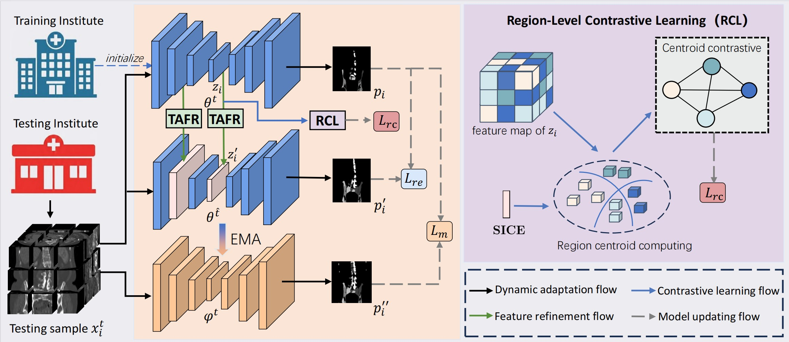
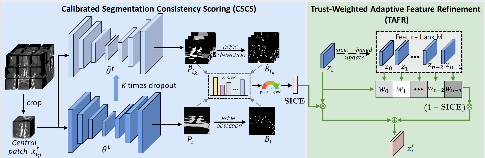

# ReGA

## Overall framework1



## Component


## Dataset

The datasets can be downloaded from the following links:

- **CLINIC**:  [Zenodo](https://zenodo.org/record/4588403#.YEyLq_0zaCo)
- **KITS19**:  [GitHub](https://github.com/neheller/kits19)
- **MSD_T10**: [Google Drive](https://drive.google.com/file/d/1m7tMpE9qEcQGQjL_BdMD-Mvgmc44hG1Y/view?usp=sharing)

To reproduce the visual examples illustrated in the manuscript, please perform inference on the following cases using their associated pre-trained weights:

- **Case A**: Case 203 from the KITS19 dataset
- **Case B**: Case 5 from the MSD_T10 dataset
- **Case C**: Case 246 from the KITS19 dataset


## How to use
### Source training 
For training details, refer to the instructions on the [CTPelvic1K GitHub repository](https://github.com/MIRACLE-Center/CTPelvic1K).  
The source model weights pre-trained on the CLINIC dataset are provided at `ReGA_main/weights/cascade_fullres_CTpelvic_fold0.path`.

### ReGA
Use
```
cd ReGA_min/code
python TA_eval.py --mode train_only
python TA_eval.py --mode test_only
```
to get the test-time adaptation results.  
The model weights adapted with ReGA on the KITS19 and MSD_T10 datasets are available at the following locations:

- `ReGA_main/weights/final_adapted_model_Kits.path`
- `ReGA_main/weights/final_adapted_model_MSD.path`

